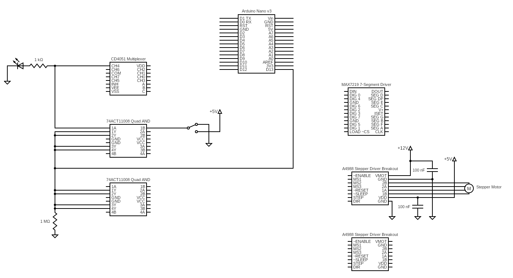

# :video_game: LukeWarmBeer :beers:

## Contributing

You can set up your environment using the bootstrap script `. scripts/boostrap`, then any of the invoke commands in `tasks.py`.

| Command   | Effect                                                                       |
|-----------|------------------------------------------------------------------------------|
| `compile` | Compiles the `ino` sketch in `src/LukeWarmBeer`. Hardcoded to `avr` targets. |
| `upload`  | Uploads the compiled sketch to a board\*                                     |
| `devices` | Lists connected devices                                                      |

_* The current setup assumes that only one board is connected at a time. It will grab the port of the first connected device it sees through `arduino-cli board list` and use it as target._

## Schematic

To edit the schematic below, go to https://www.circuit-diagram.org/editor/open and import the .cddx file in `circuit/`. It can also be viewed at https://crcit.net/c/4992981ec4af4ab395cb0c2e95898edd.

## Bill of Materials

| Description               | Part Number             | Quantity | Approx Cost Per |
|---------------------------|-------------------------|----------|-----------------|
| Microcontroller           | Arduino Nano v3         |          |                 |
| Quad AND                  | 74ACT11008N             | 2        | 3.82 CAD        |
| 8 channel multiplexer     | CD4051                  |          |                 |
| 7 segment display driver  | MAX7219                 |          |                 |
| 4 digit 7 segment display |                         |          |                 |
| 2 digit 7 segment display |                         |          |                 |
| 1 digit 7 segment display |                         |          |                 |
| Stepper motor driver      | A4988 breakout (Pololu) | 2        | 5.95 USD        |
