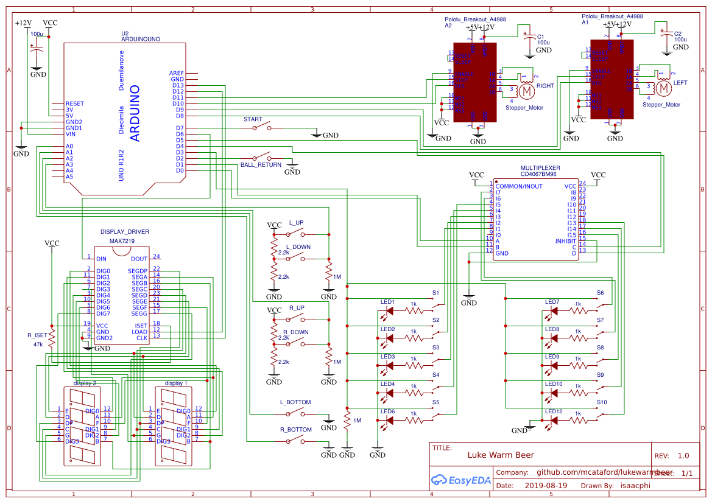

# :video_game: LukeWarmBeer :beers:

## Contributing

You can set up your environment using the bootstrap script `. scripts/boostrap`, then any of the invoke commands in `tasks.py`.

| Command   | Effect                                                                       |
|-----------|------------------------------------------------------------------------------|
| `compile` | Compiles the `ino` sketch in `src/LukeWarmBeer`. Hardcoded to `avr` targets. |
| `upload`  | Uploads the compiled sketch to a board\*                                     |
| `devices` | Lists connected devices                                                      |

_* The current setup assumes that only one board is connected at a time. It will grab the port of the first connected device it sees through `arduino-cli board list` and use it as target._

## Schematic

Circuit was drawn using easyeda.com
https://easyeda.com/editor#id=|5c82f9019097461287bc8b2208835527

__Important note__: The joysticks are subbed with 10K linear potentiometers, the pin being read as output for those potentiometers should have a ~100ohms resistance on it so that the maximal current when the variable resistance is minimal is at most 50mA.

## Bill of Materials

| Description                   | Part Number                       | Quantity | Approx Cost Per |
|-------------------------------|-----------------------------------|----------|-----------------|
| Microcontroller               | Arduino Nano v3                   |          |                 |
| Quad AND                      | 74ACT11008N                       | 2        | 3.82 CAD        |
| 16 channel multiplexer        | 74HC4067                          |          |                 |
| 7 segment display driver      | MAX7219                           |          |                 |
| 4 digit 7 segment display     |                                   |          |                 |
| 2 digit 7 segment display     |                                   |          |                 |
| 1 digit 7 segment display     |                                   |          |                 |
| Stepper motor driver          | A4988 breakout (Pololu)           | 2        | 5.95 USD        |
| Timing belt and shaft coupler | https://tinyurl.com/y4ls89b8      |          |                 |
| Telescoping rod               | e.g. https://tinyurl.com/y29gk65v |          |                 |
| 5/8 inch Ball bearing         |                                   |          |                 |
